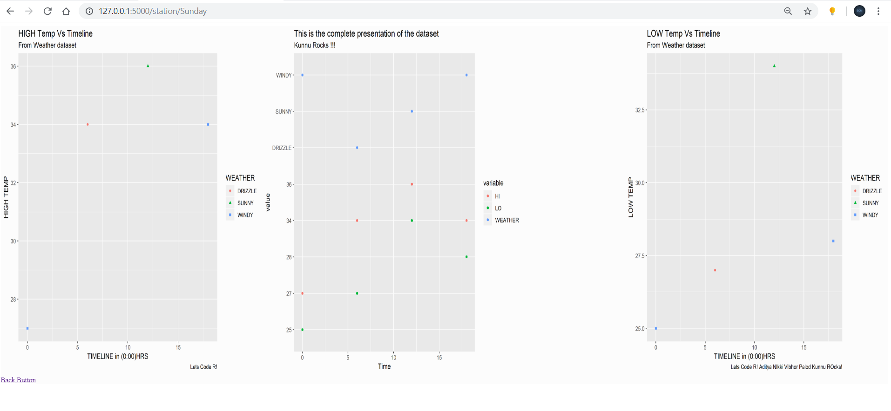
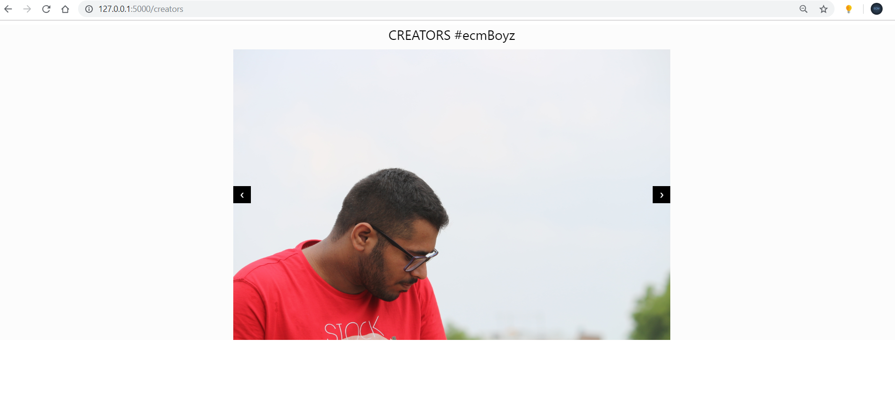

# Weather-Data-Visualisation-in-R

It is a Flask Based Webapp that provides various dates/days to choose from and after the users selection
 

runs an Rscript that plots (ggplots) that days weather data and returns the created plot in the app

It thus has a blend of both python and R ...

Some glimplses :
<h2>Main Page</h2>

 
 
<h2>Dashboard</h2>

 
 
<h2>Creators_Page</h2>

